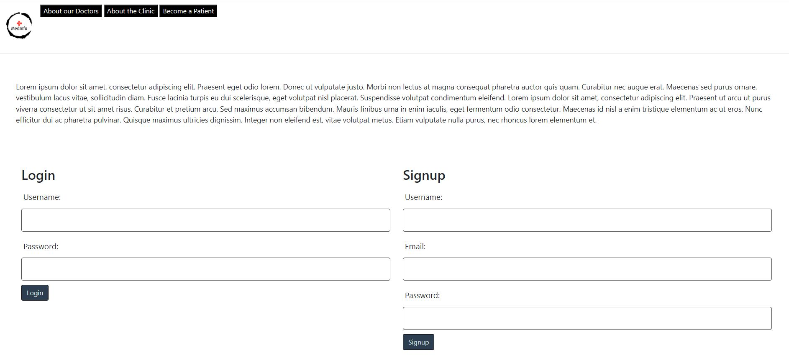
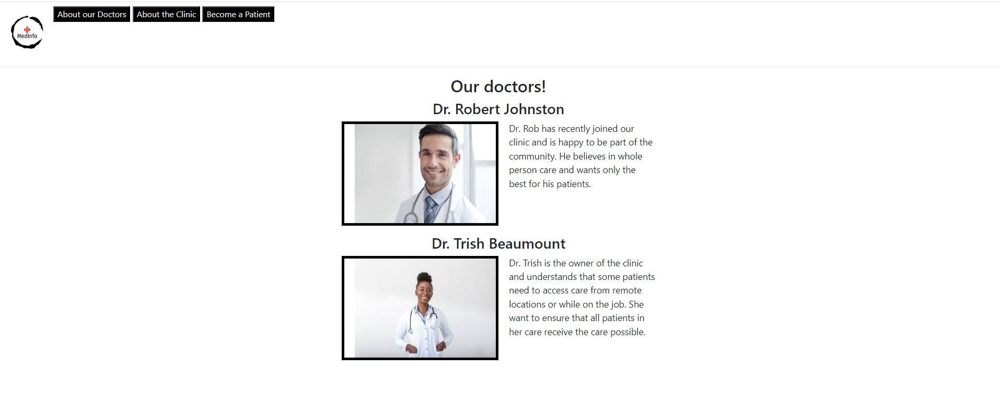
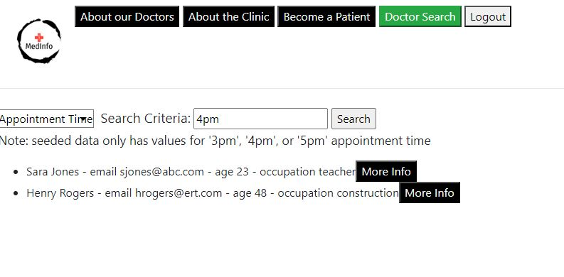
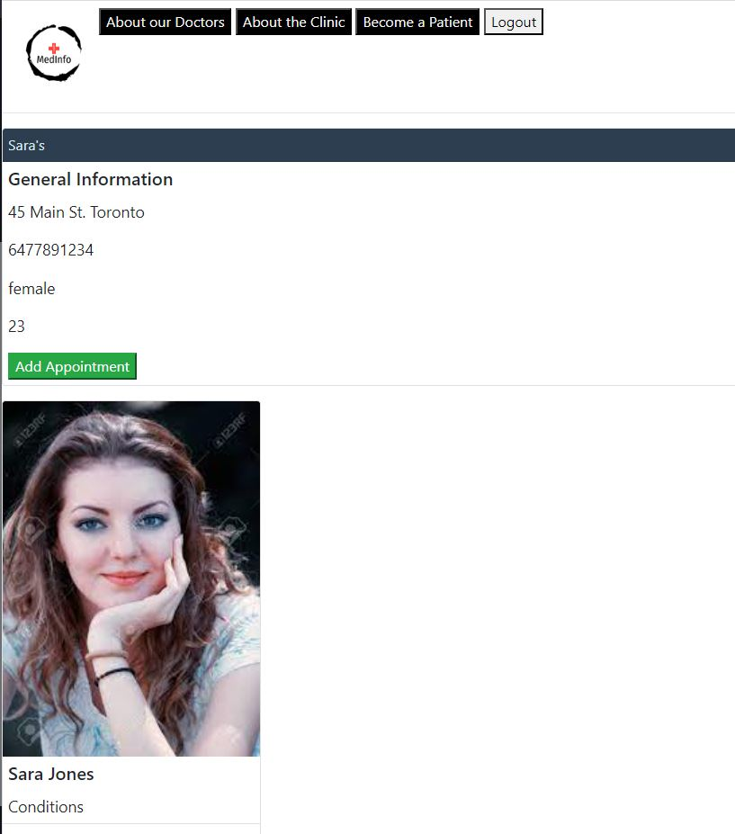
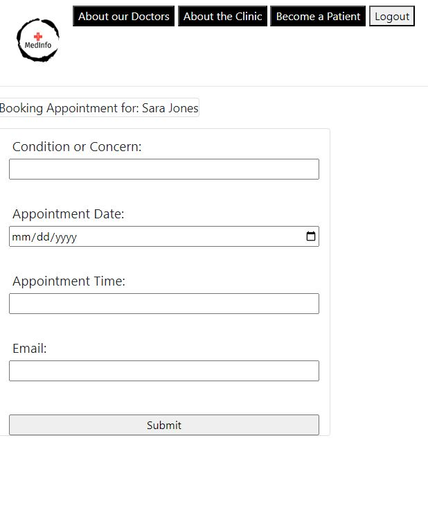

# MEDINFO

Project 2 for team: Jan Dunk, Leo Gurgel, and Max Walent

<a href='https://medicalinfo-db-397969924a16.herokuapp.com/'>Deployed Link</a>

## DESCRIPTION

A tracker for medical information to be used by a clinic. Has 3 authorization levels: not logged in, logged in as patient, and logged in as doctor. The levels allow different access to pages across the site. Patients are capable of seeing their indivial information including examination notes and future/past appointments. Doctors are able to view the information for all patients and search the patient database.  

For searching patients you can use 'sara jones'

## LOGIN DETAILS

Doctor
User: robjohnston234
Pass: pass122

Patient
User: sjones123
Pass: 1234

## TABLE OF CONTENTS
* [Installation](#installation)
* [Contributing](#contribution)
* [Screenshots](#screenshots)
* [License](#license)

## INSTALLATION
1 - Make sure you have Insomnia and Node.js preinstalled on your machine.  
2 - Clone this application repository into a local folder in your computer.  
3 - On your command line, navigate to this application folder, and run the command <npm install> to install the required NPM packages. 

## CONTRIBUTING
You are welcome to help if you have any ideas to improve our project! If you want to do so, just follow these steps:

1 - Fork the repository.  
2 - Create a new branch for you new feature or bug fix.  
3 - Make the changes you have in mind.  
4 - Commit your changes and push them to your fork.  
5 - Open a pull request detailing the changes you've made.

## SCREENSHOTS

 
 
 
 
 

## LICENSE

MIT License

Copyright (c) [2023] [Jan Dunk, Leo Gurgel, and Max Walent]

Permission is hereby granted, free of charge, to any person obtaining a copy
of this software and associated documentation files (the "Software"), to deal
in the Software without restriction, including without limitation the rights
to use, copy, modify, merge, publish, distribute, sublicense, and/or sell
copies of the Software, and to permit persons to whom the Software is
furnished to do so, subject to the following conditions:

The above copyright notice and this permission notice shall be included in all
copies or substantial portions of the Software.

THE SOFTWARE IS PROVIDED "AS IS", WITHOUT WARRANTY OF ANY KIND, EXPRESS OR
IMPLIED, INCLUDING BUT NOT LIMITED TO THE WARRANTIES OF MERCHANTABILITY,
FITNESS FOR A PARTICULAR PURPOSE AND NONINFRINGEMENT. IN NO EVENT SHALL THE
AUTHORS OR COPYRIGHT HOLDERS BE LIABLE FOR ANY CLAIM, DAMAGES OR OTHER
LIABILITY, WHETHER IN AN ACTION OF CONTRACT, TORT OR OTHERWISE, ARISING FROM,
OUT OF OR IN CONNECTION WITH THE SOFTWARE OR THE USE OR OTHER DEALINGS IN THE
SOFTWARE.
